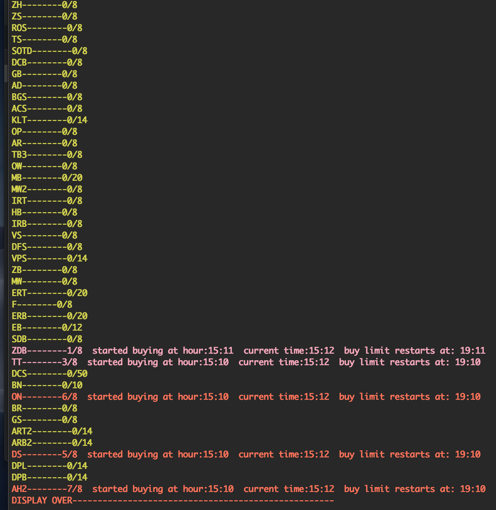

# Runescape-investment-tracker
A tool that offers functionality to help with arbitrage on virtual commodity markets.
# Navigation
- [Demo](#video-of-it-working)
- [interacting with the app](#interacting-with-the-app)
- [configuring and running the app](#overview-of-configuring-and-running-the-app)
- [software](#software-needed)


## Video of it working

https://youtu.be/o6N8kkfULcQ

Speech to text at 1:09
text to speech at 2:39


## Why does it exist?

### Buying from impatient sellers and selling to impatient buyers

Runescape is a game with a complex and player driven economy. The main way people trade with others is through an in-game feature
called the Grand Exchange (abbreviated to GE). The GE allows players to buy and sell items for the price they set and the only way these
offers complete(the item gets sold or bought) is when other players put compatible offers(compatible doesn't mean exactly the same price).

Due to the natural impatience in wanting to get items and sell items, there arises an opportunity to buy from the impatient
sellers and sell to the impatient buyers. But, there are a lot of items you can carry out this very general process with and there is a lot
to keep track of when doing this investing. That's where this tool comes in.

Before we delve into the functionality of the app, when investing in runescape in this way, to maximize your profit, these are the main
things you need to keep track of:


## What you need to keep track of

1. the list of items you want to do.
2. the buy limit of each item (the GE places a cap on the amount of certain items you can buy every four hours and this cap refreshes 4 hours since you bought the first of the item)
3. the quantity that you have currently bought and thus how many more of that item can you buy before you hit the cap. 
4. whether you can do an item 
5. whether you have already done an item (similiar to above) 
6. when the buy limit refreshes so you can do items you have already done, again. 
7. since you need to know when the buy limit refreshes, you also need to know when you bought the first of that item.
8. all of the above but for potentially several accounts (if you want to really make money). 


## How does the app keep track of all that stuff?

There are two classes in models.py
-Account
-Item


Account
```

def __init__(self,name):
        self.name = name
        self.itemlist = self.initializelist(name)
```

Item
```
def __init__(self, name, limit,quantity = 0,done = "N",time = None):
        """
        Initializes an item object

        Parameters:
        name : the name of the item as a string.
        limit : the amount of times it can be bought in a 4 hour period
        quantity: the amount of times it has currently been bought.
        done : whether it has been bought before.
        time: the time it was first bought.
        """
        self.name = name 
        self.quantity = quantity
        self.limit = limit
        self.time = time
        self.done = done
```

(1) is kept track of by having the Account class have a field called itemlist in which there are a bunch of Item objects in a list with
each of those Item objects is referring to an item the Account can invest in.

(2) is kept track if by the Item object being initialized with a buy limit(denoted by argument 'limit')

(3) is kept track of by the quantity field in an Item object. The display function (shown below) displays the amount there is left by displaying the 'amount currently bought/buy limit'.

(4) is kept track of by a field in Item called 'done'. The display function displays the item in a different color depending on the status of the item, such as whether it has been 'done' already.

(5) is kept track of by the quantity field in the item as you can't invest in an item if you have hit the buy limit. The display function takes a less specific aproach to this as I make it such that if you purchased more than 50% of an item's buy limit it displays as red, which typically means to me that i won't do it again. There is nothing stopping me from investing in the item again as I haven't hit the buy limit, but i typically don't invest in it again when an item is red because it means that i stopped investing in it prematurely which typically means it isn't going well.

(6) is taken care of by a method in the Account class called refresh.
```
def refresh(self):
        """
        Every four hours the buy limit for an item is reset. This method, checks the item list
        to see if there were items bought > 4 hours ago and if so, clears the times they have 
        been bought as now they can be bought again up until the buy limit
        """
        currentmin = time.localtime().tm_min
        currenthour = time.localtime().tm_hour 
        currentday = time.localtime().tm_mday
        for item in self.itemlist:
            if item.done == "Y":
                if currentday == item.time.tm_mday:
                
                    if abs((currenthour + (currentmin/60))- (item.time.tm_hour + (item.time.tm_min/60))) >= 4:
                        item.reset()
                else:
                
                    distancefromnextday = 24 - item.time.tm_hour + item.time.tm_min/60
                    distancefromprevday = currenthour + currentmin/60
                    if distancefromnextday + distancefromprevday >= 4:
                        item.reset()
```
Refresh is run every time the item lists are displayed (whenever the user wants to see them) and it checks to see for all items the item list, wether the first purchase of that item was greater than or equal to four hours ago. If so, it calls a method in the Item class caled reset().

```
def reset(self):
        """
        resets an item by setting the times it was bought to 0 and the field representing
        wether it has been bought to show it hasn't and the time to none - as it hasn't been bought yet,
        this method is typically called every four hours, when the buy limit resets.
        """
        self.quantity = 0
        self.done = "N"
        self.time = None
```

(7) is taken care of by the time field in the item object. The time field is only updated when the item is purchased for the first time (so when its quantity is 0) and not for subsequent purchases. So the time field only reflects when you first purchased that item.

(8) is taken care of by the ability to create multiple accounts with different item lists.

## interacting with the app

A user can see and update the itemlists for each account. 

### updating the item lists
To update the itemlists the user can issue a text command such as "<name of account in account_map> <item name> <quantity>" bought'
for example, there is an item called AGS and lets say the user bought 8 of them on an account the user named "R". 
to update that accounts item list, the user types in "R AGS 8" and bam, the list is updated.

The user can also update the item list using speech to text by issuing a command like "<account name as defined in account_map> SPEECH" followed by saying outloud what the items were (all the items are initials so you would pronounce AGS not as each individual letter- i set it up this way as there is very little ambiguity and the text to speech analyzer rarely messed up with initials). So, for example this would be the command for an account called R. "R SPEECH" and followed by saying the item intials outloud.
        
 Both methods of updating rely on a method in Item called update.
 ```
 def update(self,name,quantity="NA"):
        """
        updates an item in the item list so its quantity and status reflects the user's input

        Parameters:
        name:the name of the item as given in the dictionary that was used to inialize the list.
        quantity: the amount of items the user inputs. This refers to the amount of that item
                  the account has purchased.
        """
        for item in self.itemlist:
            if item.name == name:
                item.done = "Y"
                if item.quantity == 0:
                    item.time = time.localtime()
                item.quantity = item.quantity + int(quantity)
```
update changes the appropriate fields of the Item in the itemlist of the appropriate account specified.


### displaying the itemlists

The item list can be displayed in two ways.

One, is just issuing the command "<account name as defined in account_map> DISPLAY"
so, something like "R DISPLAY".
        
The other way to "display" is text to speech by issuing the command "<account name as defined in account_map> READ"
So, something like "R READ". This results in the items that you haven't currently done for the specefied account bieng read
out loud by your computer.
        
        
This is what the display looks like:


- items in green text haven't been purchased yet.
- items in red text mean that you have purchased 50% or more of the buy limit
- items in magenta mean that you have purchased the item but purchased less than 50% of the buy limit.

The tiem you first bought it is displayed along with the current time and the time that items buy limit refreshes so that you can buy the full quantity again.
        
        
## overview of running and configuring the app.

adding your custom list of items:Go to staticvars.py and you will find a map of item intials and their buy limit. Update this however you want.The item initials in this map is how you will refer to the items when you update items.

In main.py you can initialize an account with that itemlist by doing Account(name of the map in staticvars.py).
then you can give it a nickname that you can refer to it by in your commands by mapping the nickname to the account in account_map. EX:
```
account_map = {'R':Account(rich),'M':Account(rich),'P':Account(poor)}
```
rich and poor refer to the maps in staticvars.py that you want to have as the itemlists for those accounts.

After you have configured your itemlist and account_map you can run the app by navigating to the directory which contains main.py and typing "python main.py" in the terminal. This will start the main loop and you will be asked for input.

(assuming you have named your account 'R' in the variable account_map).
COMMANDS:
To DISPLAY:
R DISPLAY.  This displays colorful text to the console.
R READ. This causes your computer to read out the items you haven't done for account 'R'.

To UPDATE:
R item-name quantity. EX: R AGS 5. This updates the itemlist of account 'R' to reflect you bought 5 AGSs.
R SPEECH. This will stall and allow you to say out loud the items you have purchased.


## software needed.
- colorama. Used for fancy colors in terminal
- pyttsx. Used for text to speech
- SpeechRecogniton. Used for speech to text.

All the modules above can be installed by pip.


